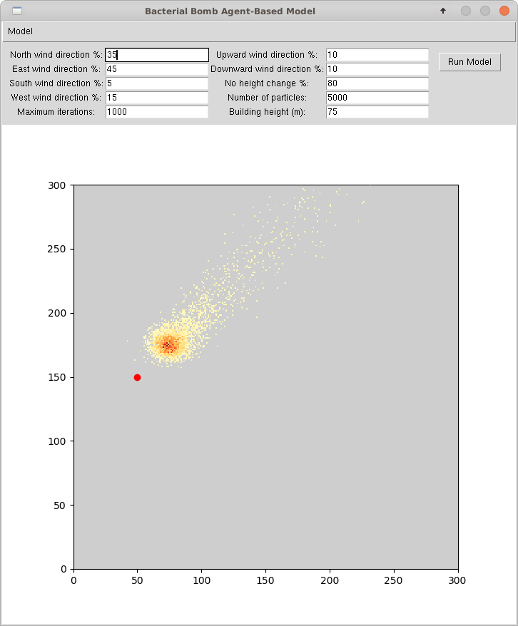

# Bacterial Bomb Agent-Based Model

This project has been developed for the University of Leeds GEOG5003M course independent project. The source code is [hosted on GitHub](https://github.com/anth-dj/geog5003m_project), including this [README](https://github.com/anth-dj/geog5003m_project/blob/master/README.md).

## Description

This project provides an Agent-Based Model (ABM) implementation for analyzing bacterial bomb fallout. The program is based on project requirements suggested in the University of Leeds GEOG5003M independent project instructions. In this ABM, a bacterial bomb is released on top of a building in some finite environment. Given input parameters for the environment wind direction and particle fall path probabilities, the model will simulate where the individual bomb particles will land within the environment. This ABM could be used as a rudimentary application for analyzing which areas of an environment should be evacuated and where resources should be allocated to address environment contamination under such a scenario.

Program output is rendered in a Graphical User Interface (GUI), which also includes editable model parameter fields.



### Model Details

The ABM scenario is constructed as follows:
- the model environment is represented as a 2-dimensional grid with a resolution of 1 m<sup>2</sup> per cell
- a single model iteration represents 1 second of time
- during each iteration, every particle will move exactly 1 metre along the environment plane and up to 1 metre vertically, if the particle has not yet reached the ground

### Stopping Conditions

The model simulation will halt once all particles have reached the ground or once the maximum configured iterations has been reached (whichever occurs first). At this point, a particle density plot will be displayed in the GUI, showing the number of particles that have landed in each cell of the environment.

### Assumptions

This basic ABM makes the following assumptions in its implementation:
- Particles only experience atmospheric turbulance that can cause it to travel upwards or not change height when they are above the origin building height. Below this height, particles always travel downward.
- There are no obstructions in the environment that could alter the path a particle takes to reach the ground 

## Usage Instructions

### Requirements

- [Python3](https://www.python.org/downloads/)

### Obtaining the Code

To obtain a copy of the source code, checkout the Git repository:
```
git clone git@github.com:anth-dj/geog5003m_project.git
```

### Launching the GUI

#### Command Prompt

From the root directory of the repository, run:

```python python/src/main.py``` 

(**Note**: use an absolute path to the Python executable if the `python` command is not in the environment path)

#### Spyder IDE

If the Spyder IDE is installed on your system:

- Run the Spyder application
- Open `python/src/main.py`
- Ensure the correct graphic settings are configured:
    - Tools > Preferences > IPython console > Graphics tab > Graphics backend
    - Set Bakcend to _Tkinter_
    - Click _OK_
    - Click Consoles menu item > _Restart Kernel_ 
- Click _Run file_ (or press F5) 

### Program Output

When the program is executed, a GUI is displayed that contains several components.

#### Toolbar

The program toolbar consists of a *Model* menu with the following items:
- **Save as text...** - saves the particle density plot from a model simulation to a text file. The file format contains one line for each row in the environment and every row is a space-delimited list of integer cell values.

- **Exit** - closes down the program


#### Editable Parameters

The GUI section immediately below the toolbar contains entry fields for editing model parameters and a _Run Model_ button that runs model simulations. Editable parameters include:

##### Wind Direction

- **North wind direction %** - the percent chance that a particle will move North during a model iteration

- **East wind direction %** - the percent chance that a particle will move East during a model iteration

- **South wind direction %** - the percent chance that a particle will move South during a model iteration

- **West wind direction %** - the percent chance that a particle will move West during a model iteration

The wind direction paramaters must each be integer values between 0-100 and must sum to 100.

##### Fall Direction

- **Upward wind direction %** - the percent chance that a particle will fall upward during a model iteration

- **Downward wind direction %** - the percent chance that a particle will fall downward during a model iteration

- **No height change** - the percent chance that a particle will not change its height during a model iteration

The fall direction parameters must each be integer values between 0-100 and must sum to 100.

##### Other parameters

- **Maximum iterations** - the maximum number of iterations (or time, in seconds) that a particle is given to reach the ground. If a particle does not reach the ground within this threshold, it will not be included in the simulation result. This value must be an integer greater than 0.

- **Number of particles** - the number of particles simulated. This value must be an integer greater than 0.

- **Building height (m)** - the building height from which the bacterial bomb is released. This value must be an integer greater than 0.

#### Plot

The remaining space in the GUI window is used to display the model environment and particle density plot that results from a simulation run. The location of the bomb is rendered as a red dot in the environment. After a simulation run, the particle density plot will be displayed in the environment. Low-density cells will be have a yellow colour and high-density cells will render in increasingly darker reds.

### Running the Model

To run an ABM simulation and generate a particle density plot for the configured parameters, click the *Run Model* button. When the button is clicked, the model parameters are updated using values in the entry fields. If there are any errors when updating the parameters, an error message will be displayed and the model simulation will be aborted. When the simulation completes, the resulting particle density plot will be displayed in the GUI and will be available to save as a text-based raster file.

The ABM environment and bomb location is read from the `python/src/wind.raster` file. This file should contain a grid of cell values, where each line represents an environment row and each row contains a space-delimited list of environment cell values. One cell must have a value of `255`, which represents the location of the bacterial bomb.

## Testing Instructions

To run the current suite of unit tests, run the command below from the project root directory:

```
python -m unittest discover python/tests/ "*_test.py"
```

Upon executing the command above, all unit tests will be run and results will be printed to `stdout`.

## Project Structure

The project file structure is as follows:

- `.gitignore` - contains information on files ignored by Git
- `LICENSE.md` - the license file
- `README.md` - the README file
- `screenshot.png` - a screenshot of the program GUI
- `python` - the source code directory
    - `src` - contains source code for the ABM program
        - `main.py` - the main Python file used to run the program
        - `wind.raster` - the environment file with a bomb location, which is read when the program is launched
        - `abm` - the agent-based model package directory
            - `__init__.py` - identifies the `abm` Python package
            - `agentframework.py` - contains classes used to represent agents
            - `logger.py` - contains utility functions for logging program output
            - `model.py` - contains classes that represent the ABM
            - `view.py` - contains classes for the program GUI
    - `tests` - contains unit test files
        - `agent_test.py` - unit tests for the agent class
        - `bomb_environment_test.py` - unit tests for the bomb environment class
        - `environment_test.py` - unit tests for the environment class
        - `particle_fall_settings_test.py` - unit tests for the particle fall settings classes
        - `position_test.py` - unit tests for the position class
        - `wind_settings_test.py` - unit tests for the wind settings classes


## Further Development

This project provides a minimal implementation of an ABM to simulate chemical weapon fallout. Further development for the project can be performed by forking or sending pull requests to this repository. Detailed documentation of the source code is included as docstrings within the Python files.

To interactively use and explore the source code, import the desired module in a running Python interpreter. Class documentation can be viewed through the `help` function.  For example, after launching a Python interpreter from the repository root directory, the following statements can be entered:

```
import python.src.abm.agentframework

help(python.src.abm.agentframework.Agent)
```

The output from these statements will be similar to the following:
```
Help on class Agent in module python.src.abm.agentframework:

class Agent(builtins.object)
 |  Agent(particle_fall_settings, wind_settings, start_position, building_height)
 |  
 |  An implementation of a bacterial bomb partical agent.
 |  
 |  The Agent can move and fall according to the configured wind and particle
 |  fall settings. The particle will start its fall from its configured
 |  start position and building height.
 |  
 |  Public Methods:
 |      
 |      move -  moves the Agent one metre North, East, South or West using the
 |              configured wind settings probabilities.
 |      
:
```

### Potential Improvements

The current implementation could benefit from numerous enhancements, including:

- Environment obstructions and additional model parameters to provide a more realistic model for chemical weapon fallout analysis
- An improved UI for modifying percentage value parameters
- The ability to dynamically select the bomb location and environment size
- A more responsive layout that displays the view correctly for small and large window sizes
- Parallelization of the model simulation (as individual particles can be simulated independently from one another)
- Improved plot view, including axis labels, a legend and a customizable colour scheme
- Adding support for model simulation animation

## License

This project is made publicly available under the MIT license (see the [LICENSE](./LICENSE) file).